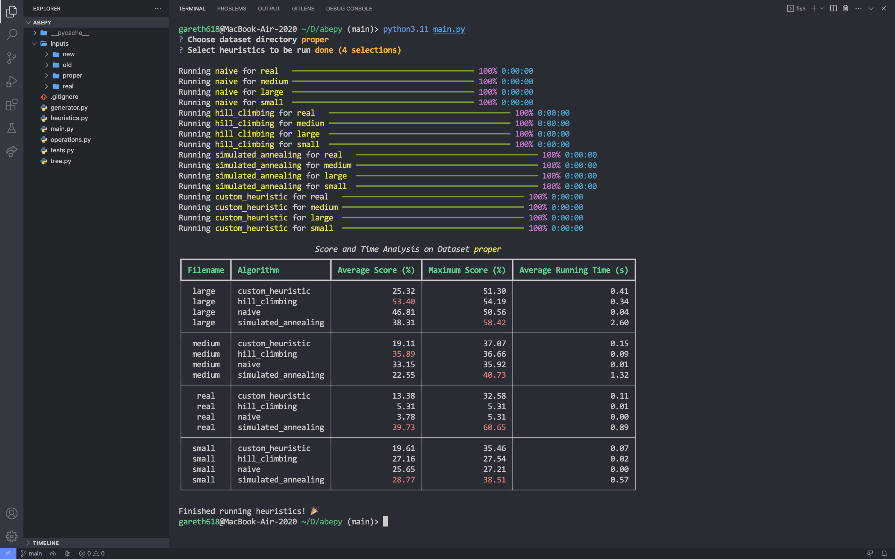

# Heuristic Optimizations for Boolean Formulas

This Python library is a friendlier version of [this](https://github.com/Juve45/Boolean-Circuit-Minimizer-for-ABE) C++ one, whose purpose was to test the heuristics proposed in [this](https://arxiv.org/abs/2305.13008) article.

## 🎊 What's new

- generalized AST operations
- documented code
- more natural test generator
- way more flexible CLI

## 📦 Installation

```sh
pip install rich questionary
git clone git@github.com:gareth618/abepy.git
cd abepy
```

## ⚗️ Creating a new dataset

```sh
python generator.py
```

The CLI will ask you for the name of the file you want to create and in which dataset should it be put. Then, you will prompt it with the parameters of the formulas you want to generate.

## 🧪 Testing the heuristics

You can easily find in code the parameters that can be adjusted (they are always default function arguments). Also, you can add your own heuristic by just defining it in `heuristics.py`.

```sh
python main.py
```

The CLI will ask you what heuristics you want to run and on which dataset. At the end, it will show a beautiful table with stats. Finally, `{dataset}/results/{heuristic}/{filename}` will contain the best formulas found for each entry in `{dataset}/{filename}` when running `{heuristic}`.


